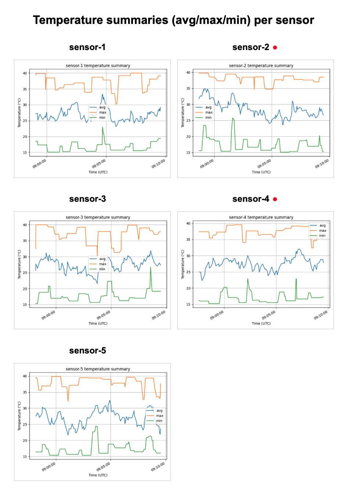

# Azure Cosmos DB Change Feed デモ

## 概要

このリポジトリは、**Azure Cosmos DB (NoSQL)** の **Change Feed** 機能と **Azure Container Apps** を用いてリアルタイムなデータ処理パイプラインを構築する方法を示すサンプルです。
デモでは5つのIoTセンサーを想定し、それぞれランダムな間隔で温度データを生成します。
Change Feedを購読するサマライザーが最新のデータから統計量を計算し、ビジュアライザーが集約結果をグラフとして表示します。

<div align="center">
  
  <p><em>図1 – アプリ画面のスクリーンショット</em></p>
</div>

Change FeedはCosmos DBコンテナへの変更を **追記されたデータ専用のストリーム** として公開し、全件検索することなく新しい書き込みや更新を検出できます。
IoT・ゲーム・リアルタイム分析など、イベント駆動型アーキテクチャに適したパターンです。

<div align="center">
  
  <p><em>図2 – Change Feedによってイベント駆動型アプリケーションを効率的かつスケーラブルに構築できます。</em></p>
</div>

## クイックスタート

### 前提条件

* **Azure サブスクリプション** – リソースグループを作成できる権限が必要です。
* **Azure CLI (`az`)とAzure Developer CLI(`azd`)** – これらのツールでインフラの構築とデプロイを自動化します。
インストール方法は[Azure CLI](https://aka.ms/install-azure-cli)と[azd ドキュメント](https://aka.ms/azd)を参照してください。
* **Git** – リポジトリをクローンするため。

### デプロイ手順

1. **リポジトリをクローン**:

   ```bash
   git clone https://github.com/rioriost/cosmos-cf-demo/
   cd cosmos-cf-demo
   ```

2. **サインインと初期設定**:

   ```bash
   az login
   azd auth login
   ```

3. **インフラ構築とデプロイ**:

   ```bash
   azd up
   ```

   `azd up`コマンドはBicepテンプレート (`infra/main.bicep`) に定義されたAzureリソースをプロビジョニングし、コンテナイメージをビルド・デプロイします。

4. **ビジュアライザーにアクセス**:

   デプロイ完了後、`visualizer`コンテナアプリのURLが出力されます。
   ブラウザでアクセスすると、各センサーの統計を表示するグラフを閲覧できます。
   新しい集約データが到着すると該当グラフのみが更新され、センサー名の横に赤いアイコンが表示されます。

### クリーンアップ

環境を削除するには、次のコマンドを実行します:

```bash
azd down
```

これにより、このデモで作成されたリソースグループおよびAzureリソースが削除されます。

## アーキテクチャ

このデモでは3つのサービスがAzure Container Appsで動作し、Cosmos DBアカウントに変更フィードを有効化しています。

* **generator** – 5台のセンサーを模したPythonサービスです。
  各センサーは1〜10秒のランダムな間隔で温度を測定し、`readings`コンテナに`sensor_id`、`temperature`、`timestamp`を含むドキュメントを挿入します。

* **summariser** – `readings`コンテナのChange Feedを監視するPythonサービスです。
  新しい読み取りがあるとそのセンサーの直近10件のデータを取得して最大・最小・平均温度を計算し、結果を`summaries`コンテナに書き込みます。
  Change Feedによりイベントドリブンに、全件検索することなく効率的に処理できます。

* **visualizer** – Flaskアプリケーションで、`summaries`コンテナからデータを読み取り、Matplotlibを用いてグラフを生成します。
  画面は2列レイアウトとなっており、5つのセンサーそれぞれにグラフを表示します。
  データが更新されると該当センサーのグラフが自動で再読み込みされ、名前の横に赤い丸印が表示されます。

データフローは以下の通りです:

1. センサーが`readings`コンテナにデータを書き込みます。
2. Change Feedは書き込みを順番に記録し、サマライザーがこれを消費して集計結果を`summaries`コンテナに保存します。
3. ビジュアライザーは`summaries`コンテナを定期的に読み込み、グラフを更新します。

## リポジトリ構成

```
cosmos-cf-demo/
├── infra/              # Azureリソースを定義するBicepテンプレート
├── generator/          # センサー生成サービス
├── summariser/         # 集計サービス (Change Feedプロセッサ)
├── visualizer/         # ビジュアライズサービス (Flask + Matplotlib)
├── docs/               # ドキュメント用アセット (画像)
└── workshop/           # ハンズオンラボ (enとjp)
```

## 設定

インフラ構成は `infra/main.bicep` に記述され、`infra/main.parameters.json`でパラメータを指定します。
主なリソースは次の通りです。

* **Cosmos DB アカウント** – データベース`sensors`とコンテナ`readings`、`summaries`、`leases`を含みます。
  `readings`コンテナは`/sensor_id`をパーティションキーとして書き込みを分散します。
  `summaries`コンテナも`/sensor_id`でパーティション分割し、集計データを格納します。
  `leases` コンテナはChange Feedの継続トークンを保存します。
* **Azure Container Registry** – コンテナイメージを格納します。
* **Container Apps Environment** – 3つのサービスをホストします。
  各サービスはマネージドIDを用いてCosmos DBに安全にアクセスします。

## ライセンス

このプロジェクトは [MIT License](LICENSE) の下で配布されています。
自由にフォークし、目的に合わせてカスタマイズしてください。
