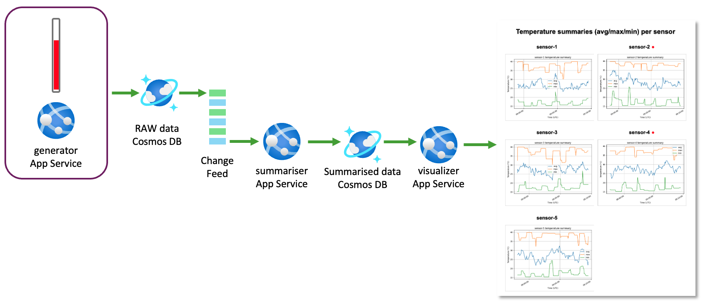

# Azure Cosmos DB Change Feed Demo

## Overview

This repository contains a small demonstration of how to build a real‑time data processing pipeline using **Azure Cosmos DB for NoSQL**, the **Change Feed** feature, and **Azure Container Apps**.
The demo simulates five IoT sensors that generate temperature readings at random intervals.
A summariser application consumes the Change Feed to compute per‑sensor statistics, and a visualiser displays the aggregated results in near real‑time.

<div align="center">
  
  <p><em>Figure 1 – Screenshot of the demo</em></p>
</div>

The Change Feed exposes an **append‑only stream of changes** made to a Cosmos DB container.
It allows applications to react to inserts, updates and deletions without polling the entire dataset.
This pattern is ideal for IoT, gaming and real‑time analytics scenarios where events need to be processed as they occur.

<div align="center">
  
  <p><em>Figure 2 – Azure Cosmos DB Change Feed enables efficient, scalable, event‑driven architectures.</em></p>
</div>

<div align="center">
  
  <p><em>Figure 3 – Architechture diagram of this demo.</em></p>
</div>

## Quick Start

### Prerequisites

Before you begin, ensure the following:

* **Azure subscription** – you must have permission to create resource groups and deploy resources.
* **Azure CLI** (`az`) and **Azure Developer CLI** (`azd`) installed.
  These tools automate deployment and configuration.
  Install instructions can be found in the [Azure CLI](https://aka.ms/install-azure-cli) and [azd documentation](https://aka.ms/azd).
* **Git** to clone this repository.

### Deployment

1. **Clone the repository**:

   ```bash
   git clone <this repository>
   cd cosmos-cf-demo
   ```

2. **Sign in and initialise**:

   ```bash
   az login
   azd auth login
   ```

3. **Provision infrastructure and deploy**:

   ```bash
   azd up
   ```

   The `azd up` command provisions Azure resources defined in the Bicep template (`infra/main.bicep`) and builds & deploys the container images.

4. **Access the visualiser**:

   After deployment, `azd up` will output the URL of the `visualizer` container app.
   Navigate to this URL in a browser to see the per‑sensor summary graphs.
   The page automatically updates whenever new summaries arrive.

### Teardown

To remove all resources created by this demo, run:

```bash
azd down
```

This command deletes the resource group and associated Azure resources.

## Architecture

The demo consists of three services running as Azure Container Apps and a Cosmos DB account configured with Change Feed enabled:

* **generator** – a Python service that simulates five sensors.
  Each sensor emits temperature readings at random intervals between 1 and 10 seconds.
  Documents are inserted into the `readings` container with properties `sensor_id`, `temperature` and `timestamp`.

* **summariser** – a Python service that listens to the Change Feed on the `readings` container.
  When new readings arrive, it queries the latest 10 readings for each sensor and calculates the maximum, minimum and
  average temperatures.
  The results are stored in the `summaries` container.
  The Change Feed provides an efficient way to process new events without scanning the entire collection.

* **visualizer** – a Flask application that reads summary documents and renders interactive charts using Matplotlib.
  Five plots are displayed in a two‑column grid, one per sensor.
  When new summaries are detected, the corresponding plot reloads and a red indicator appears next to the sensor
  name.

Data flows as follows:

1. Sensors write readings to Cosmos DB (`readings` container).
2. The Change Feed captures inserts in an append‑only log.
   The summariser reads this feed, processes new records and writes aggregated results to the `summaries` container.
3. The visualiser queries the `summaries` container and displays charts.
   It polls the database to detect new summaries and updates the plots in near real‑time.

## Repository Structure

```
cosmos-cf-demo/
├── infra/              # Bicep templates for provisioning Azure resources
├── generator/          # Generator service (simulates sensors)
├── summariser/         # Summariser service (Change Feed processor)
├── visualizer/         # Visualiser service (Flask + Matplotlib)
├── docs/               # Documentation assets (images)
└── workshop/           # Hands‑on lab content (en and jp)
```

## Configuration

The infrastructure is defined in `infra/main.bicep` and parameterised via `infra/main.parameters.json`.
Key resources include:

* **Cosmos DB account** with a database called `sensors` and three containers: `readings`, `summaries` and `leases`.
  The `readings` container has a partition key on `/sensor_id` to distribute writes.
  The `summaries` container is partitioned on `/sensor_id` and stores aggregated records.
  The `leases` container stores Change Feed continuation tokens.
* **Azure Container Registry** to store container images.
* **Container Apps environment** to host the three services.
  Each app uses a managed identity for secure access to Cosmos DB.

## License

This project is licensed under the [MIT License](LICENSE).
Feel free to fork and modify for your own use.
